<div align="center">

# 🛡️ TISAP — Threat Intelligence & Security Awareness Platform

**Train your team to stop real threats.** Hands-on phishing, browser and malware simulations, gamified learning, and live risk analytics — all in one platform.

[](https://primer-vertex-67013332.figma.site/)


### 🔗 **Live demo: https://primer-vertex-67013332.figma.site/**

*Use the one-click **Quick Demo Login** (Admin / HR / Employee) on the sign-in page — no account needed.*

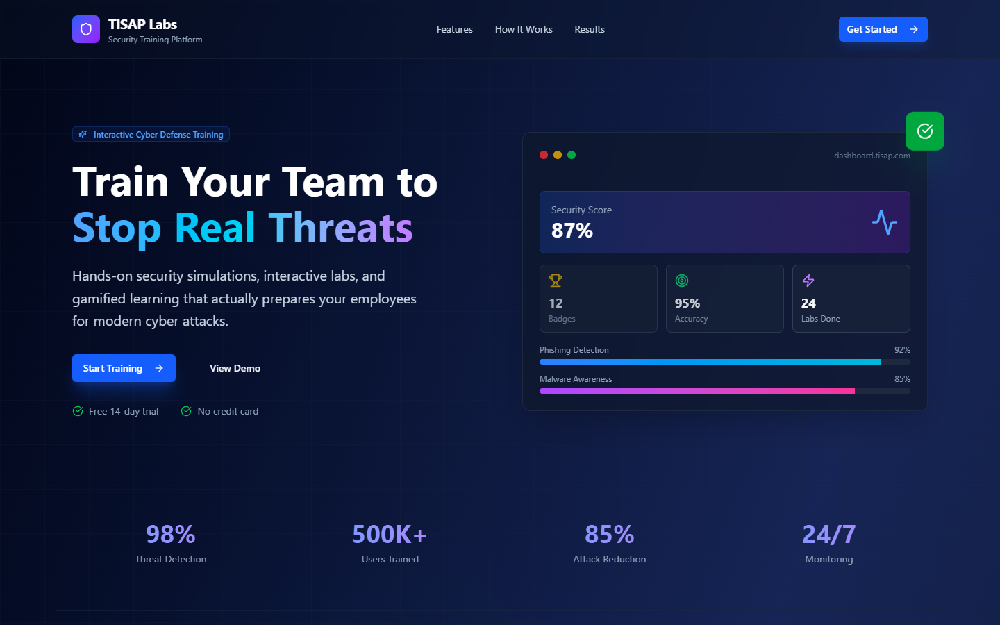

</div>

---

## 📖 What is TISAP?

Most security incidents start with a person, not a firewall. **TISAP** is a security-awareness platform that:

1. **Trains employees** through realistic, interactive simulations (a fake phishing inbox, a malicious website, a fake "Windows Defender" ransomware popup) and quizzes.
2. **Motivates them** with points, levels, streaks, badges, weekly challenges and leaderboards.
3. **Measures risk** — security events from browsers, Windows endpoints and Outlook are collected by a backend and rolled up into scores for employees, managers and admins.

It is made of two parts that work together:

| Part | Folder | What it is |
|------|--------|------------|
| 🎮 **Training Platform** (the live demo) | [`TISAP-platform/`](TISAP-platform) | Vite + React + Tailwind app: landing page, role-based login, labs, quizzes, gamification, Admin/HR/Employee dashboards |
| 📊 **Analytics Stack** | [`TISAP/`](TISAP) | Next.js risk dashboard + FastAPI backend + Chrome extension, Windows agent and Outlook add-in that generate/collect security events |

---

## ✨ Features

### 👤 Employee
- **Interactive labs** — Phishing Email Detection, Browser Security & Threats, Malware Detection & Response, Security Knowledge Quiz
- **Gamification** — points, levels, daily streaks, tiered badges (bronze → diamond), weekly challenges, leaderboards (weekly / monthly / yearly / all-time)
- **Hints & micro-training** — contextual tips, header inspection, instant feedback and confetti on success
- Personal progress and risk-score timeline

### 🧑‍💼 HR Manager
- Team oversight: training completion, at-risk employees, average security score
- Department comparisons, send announcements, export data

### 🛡️ Administrator (SOC view)
- Active threats, users monitored, running simulations, average response time
- Threat analytics (phishing / malware / ransomware / social) and risk distribution (critical → low)
- Time-range filters (24h / 7d / 30d / 90d) and report export

### 🔌 Event Collection (TISAP stack)
- **Chrome extension** — simulates click / report / ignore events
- **Windows agent** — Tkinter app simulating open-file / execute-script / report-threat
- **Outlook add-in** — ribbon button for attachment-opened / link-clicked / report-suspicious
- **FastAPI backend** — `POST /api/events`, `GET /api/data`, `GET /api/users`, `POST /api/assign-remedial`

---

## 📸 Screenshots

| Role-based login | Admin / SOC dashboard |
|---|---|
| 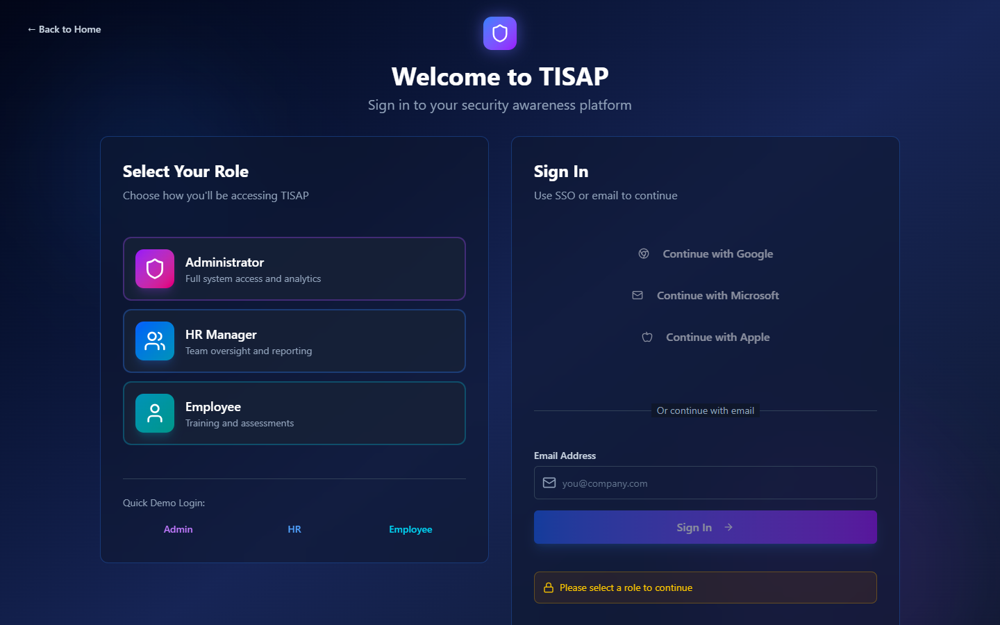 | 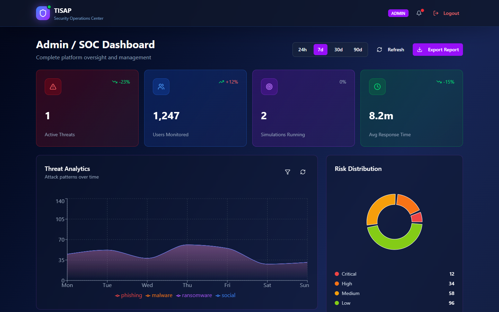 |

| HR dashboard | Employee dashboard |
|---|---|
| 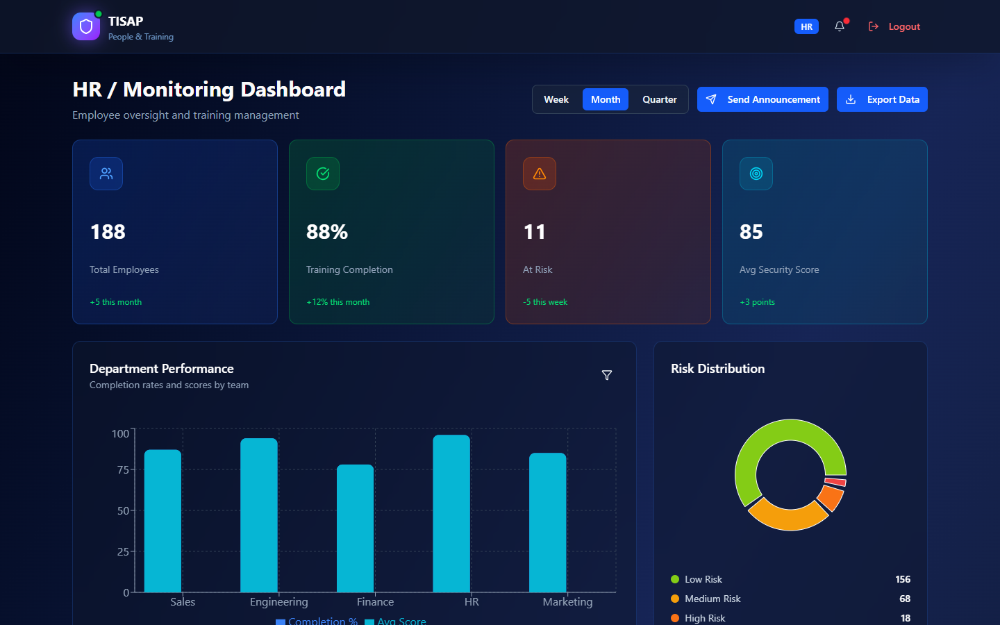 | 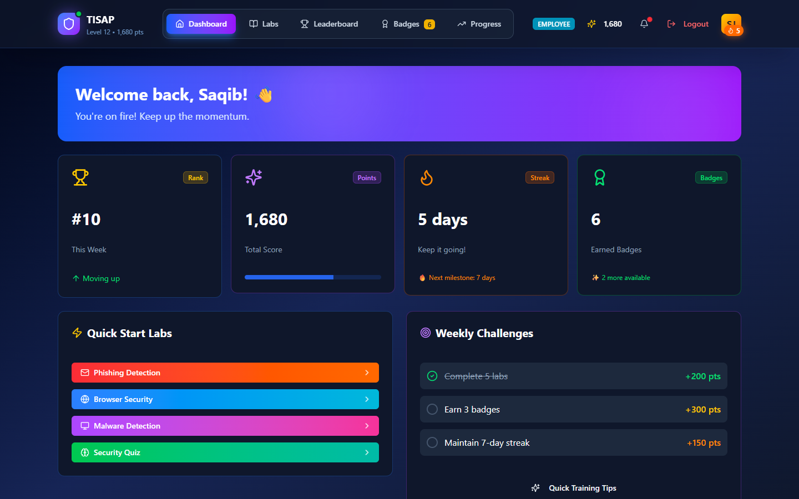 |

| Training labs | Phishing email lab |
|---|---|
| 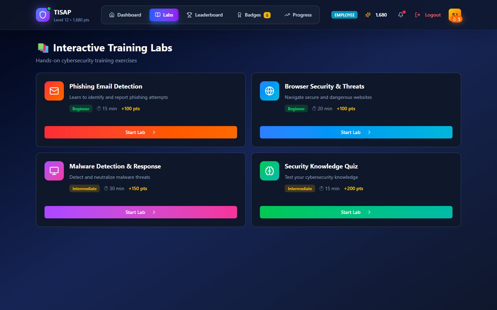 | 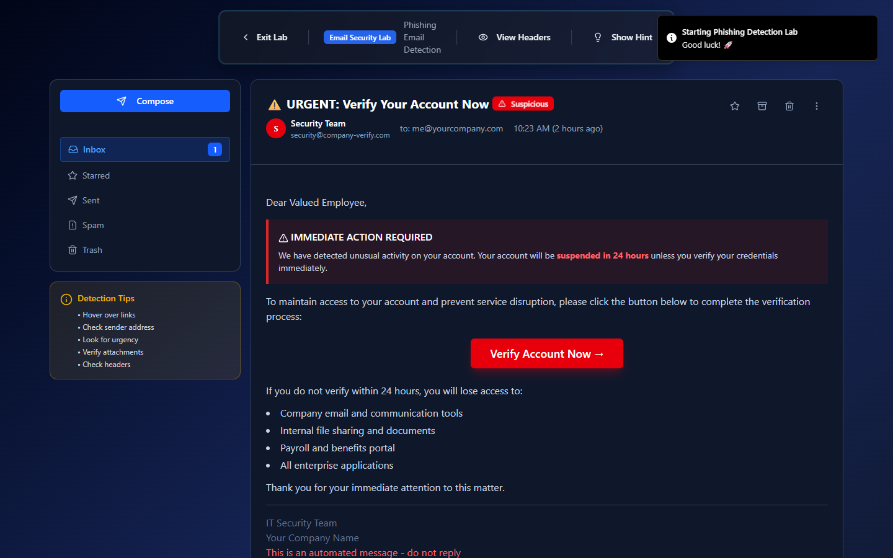 |

| Malware / ransomware lab | Browser security lab |
|---|---|
| 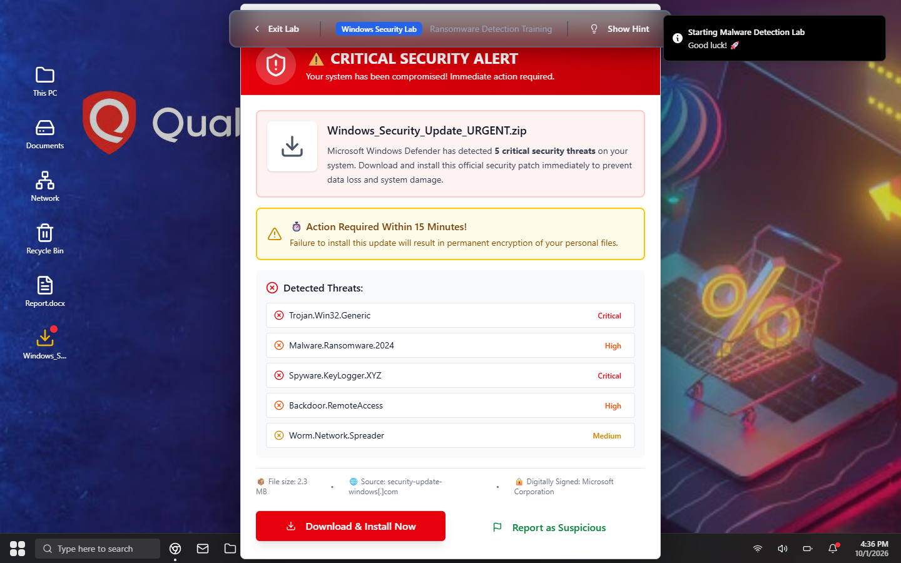 | 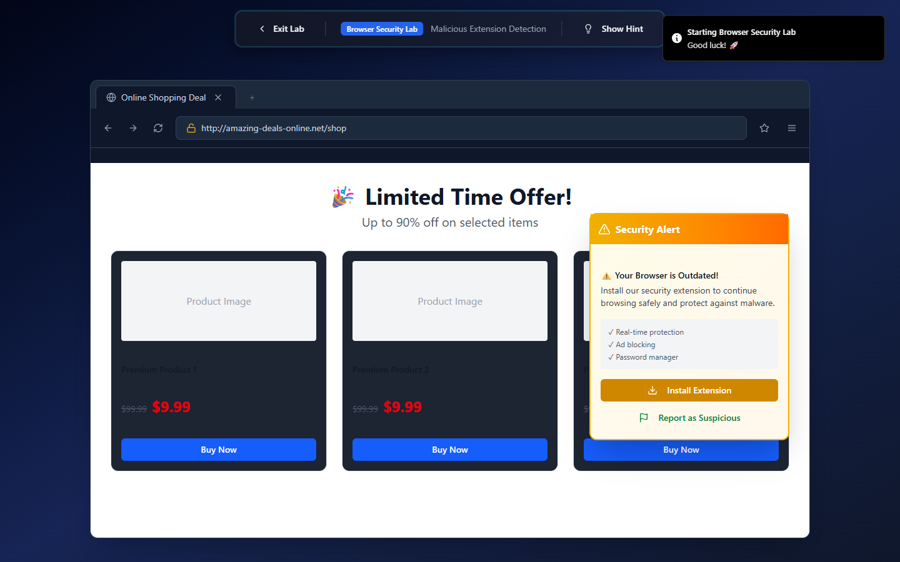 |

| Leaderboard | Badges |
|---|---|
| 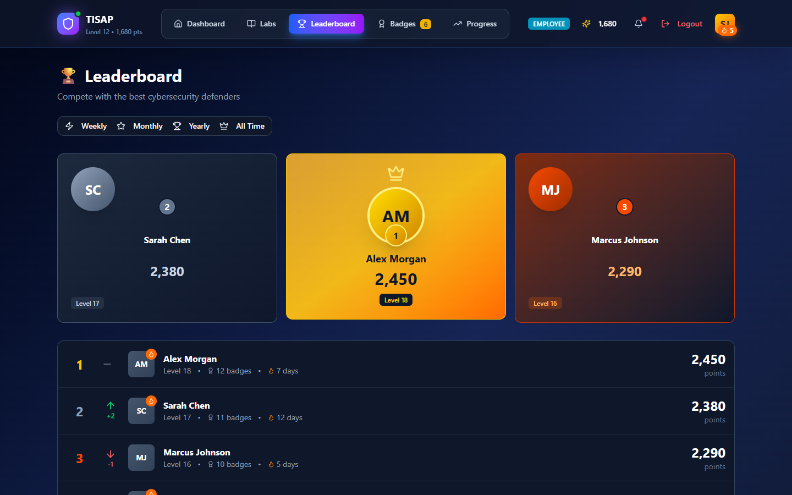 | 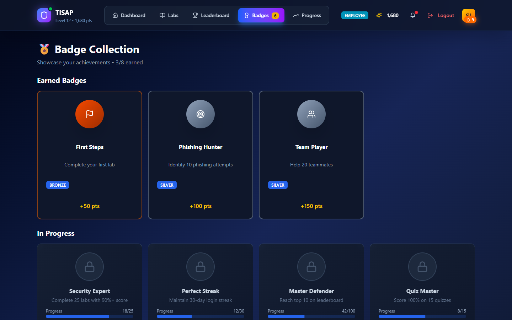 |

| Security quiz |
|---|
| 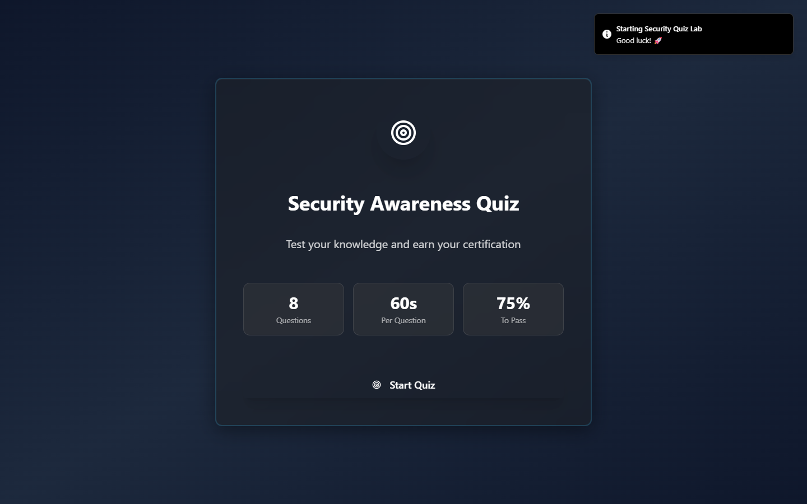 |

---

## 🗂️ Repository Structure

```
Innovative/
├── TISAP-platform/        # Training platform (Vite + React + Tailwind v4) — the live demo
│   └── src/app/components/  # Landing, Login, dashboards, labs, quiz, badges, UI kit
├── TISAP/                 # Analytics stack
│   ├── app/ components/     # Next.js 14 dashboard (Admin / Manager / Employee)
│   ├── backend/             # FastAPI event + metrics API
│   ├── extension/           # Chrome MV3 extension
│   ├── windows-agent/       # Python/Tkinter endpoint simulator
│   └── outlook-addin/       # Outlook add-in (React + Office.js)
└── docs/screenshots/      # Images used in this README
```

## 🧰 Tech Stack

- **Training platform:** React 18, Vite, Tailwind CSS v4, Radix UI / shadcn-style components, Motion, Recharts, Lucide icons
- **Analytics dashboard:** Next.js 14 (App Router), TypeScript, Tailwind, Recharts
- **Backend:** Python, FastAPI, Uvicorn, Pydantic (in-memory store for demo)
- **Integrations:** Chrome Extension (Manifest V3), Tkinter + Requests, Office.js

---

## 🚀 Getting Started

### Training platform (the live demo)
```bash
cd TISAP-platform
npm install
npm run dev
```

### Analytics stack
```bash
# 1. Backend  → http://localhost:8000  (docs at /docs)
cd TISAP/backend
pip install -r requirements.txt
uvicorn main:app --reload --port 8000

# 2. Dashboard → http://localhost:3000
cd TISAP
npm install
npm run dev
```

Then optionally load the Chrome extension (`TISAP/extension`), run the Windows agent (`python TISAP/windows-agent/tisap_agent.py`) or sideload the Outlook add-in (`TISAP/outlook-addin`) to send live events. See each folder's README for details.

> The training platform currently uses demo/mock data; the analytics dashboard falls back to mock data when the backend is offline.

---

## 🛣️ Roadmap
- Connect the training platform to the FastAPI backend
- Persistent database (replace in-memory storage) and real authentication / SSO
- Production-grade scoring model and remedial-training assignment workflow

## 📄 License

Proprietary — all rights reserved.

<div align="center">

**[🔗 Try the live demo](https://primer-vertex-67013332.figma.site/)**

</div>
